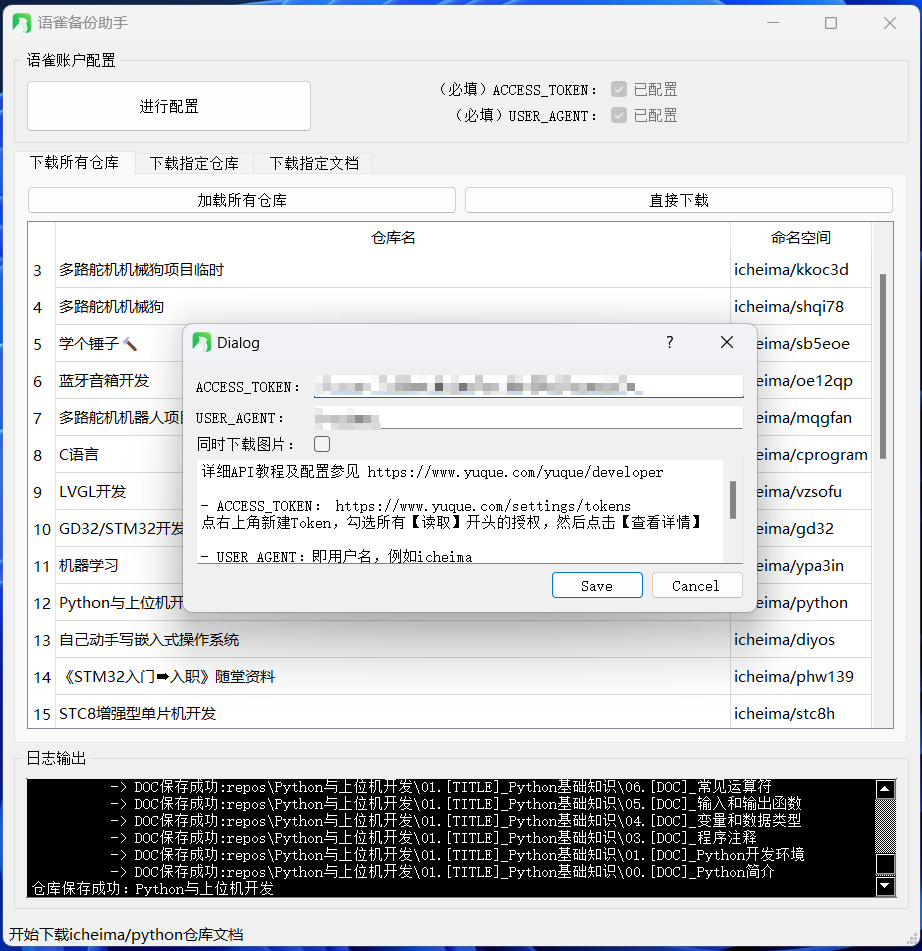
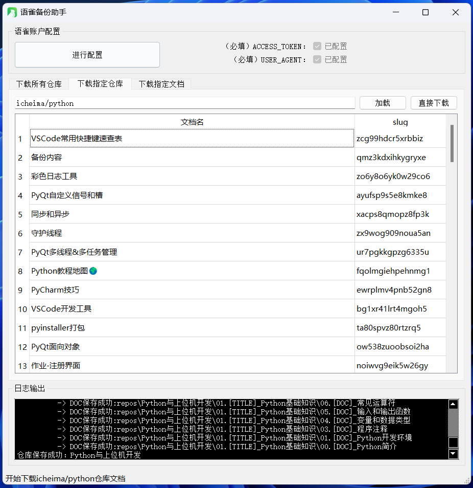

# YuQueBackup 语雀一键备份

#### 介绍

语雀备份工具，未雨绸缪，定期备份，防止哪一天网站突然无法访问，多年积攒的内容付之一炬。欢迎Star，提PR

代码使用python语言，提供一键备份功能。

- 一键备份所有仓库
- 一键备份指定仓库
- 一键备份指定文档

[v1.0客户端下载](https://gitee.com/tangyang/yu-que-backup/releases/tag/v1.0) 自己摸索着用，没空写教程。
目前只有Win版。Mac、Linux版客户端随后编好了就上传





---

===================**如果使用客户端，就不用下边的所有操作啦** ===================

#### 环境依赖
- `yyaml`
- `requests`

#### 安装教程

- 下载代码
```shell
git clone https://gitee.com/tangyang/yu-que-backup.git
```

- 安装依赖
```shell
pip install -r requirments.txt
```


#### 使用说明

1. 安装Python环境
2. 根据安装教程下载代码并安装依赖
3. 在`secret.yaml`配置Token

```yaml
# 必选配置: 【账户设置】-【开发者】-【Token】-【新建】 参见https://www.yuque.com/yuque/developer
ACCESS_TOKEN: ""
USER_AGENT: ""
# 可选配置，如果需要备份并下载图片，可添加此配置，需要从浏览器中拷贝
COOKIES: ""
```

4. 使用如下命令备份仓库

```shell
# 备份所有仓库 
python main.py
# 备份单个仓库, 以icheima/stc8h为例
python main.py icheima/stc8h
# 备份单个文档，以icheima/python/dev_pygame_snake为例
python main.py icheima/python/dev_pygame_snake
```


#### 开发计划

- 支持Linux配置定期备份计划
- 支持桌面客户端操作（基于PyQt5）
